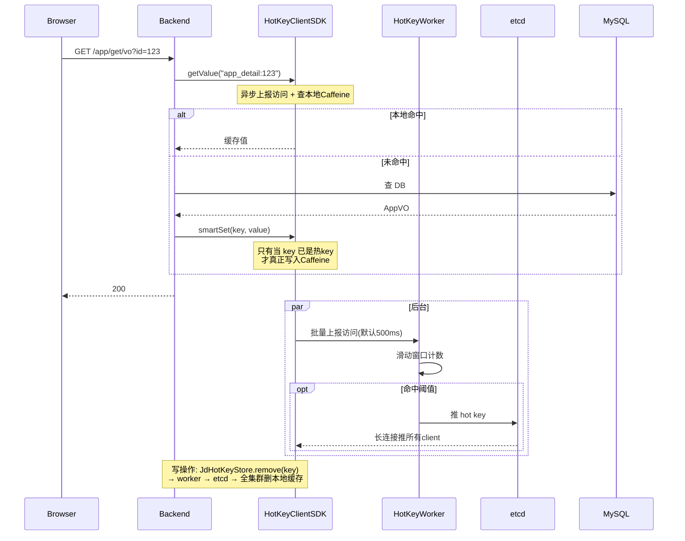

## 1. 整体架构



JD-HotKey 与现有 `MultiLevelCacheTemplate` **互补共存**：
- 列表分页（精选/我的）key 可枚举、量小 → 继续用 `MultiLevelCacheTemplate`
- 详情 / 首屏对话 key 海量、热点稀疏 → 用 JD-HotKey 自动探测

---

## 2. 中间件准备（你部署，文档里写清楚）

需要在服务器侧准备 3 个组件（worker/dashboard 都是 jar，从 [jd-hotkey 仓库](https://gitee.com/jd-platform-opensource/hotkey) Release 下载）：

- `etcd v3.x`（单机即可，docker 一行起来）
- `hotkey-worker`（至少 1 个，建议 2 个高可用）
- `hotkey-dashboard`（配规则用，可选；不部署也能用 etcdctl 写规则）

---

## 3. 依赖与配置

### 3.1 [pom.xml](pom.xml) 新增

```xml
<dependency>
    <groupId>com.jd.platform.hotkey</groupId>
    <artifactId>hotkey-client</artifactId>
    <version>0.0.4-SNAPSHOT</version>
</dependency>
```

注意：JD-HotKey 客户端发布在 jd-platform 自己的仓库，需要在 `pom.xml` 里加 repository，或本地 `mvn install` 一次。具体仓库地址会在实现时确定。

### 3.2 [application.yml](src/main/resources/application.yml) 新增

```yaml
hotkey:
  app-name: hl-ai-code-mother
  etcd-server: http://localhost:2379
  push-period-ms: 500
  caffeine-size: 5000
```

### 3.3 新建 `src/main/java/com/hl/hlaicodemother/config/HotKeyConfig.java`

- 用 `@Value` 注入上面 4 个配置
- `@PostConstruct` 调用 `ClientStarter.Builder().setAppName(...).setEtcdServer(...).startPipeline()`
- 仅初始化客户端，不暴露 Bean（`JdHotKeyStore` 是静态工具类）

---

## 4. 核心模板：HotKeyCacheTemplate

### 新建 `src/main/java/com/hl/hlaicodemother/manager/cache/HotKeyCacheTemplate.java`

封装 JD-HotKey 的 `getValue + smartSet + remove` 三件套，对外提供和现有 `MultiLevelCacheTemplate` 相似的 API，业务调用方无感知。

```java
public <T> T getOrLoad(String key, Class<T> clazz, Supplier<T> loader) {
    Object cached = JdHotKeyStore.getValue(key);
    if (cached == NULL_HOLDER) return null;
    if (cached != null) return (T) cached;
    T value = loader.get();
    JdHotKeyStore.smartSet(key, value == null ? NULL_HOLDER : value);
    return value;
}

public void evict(String key) {
    JdHotKeyStore.remove(key);
}
```

要点：
- `smartSet` 内部会 `isHotKey()` 校验，**非热 key 直接 no-op**，所以非热门数据不会污染本地内存
- 用 `NULL_HOLDER` 哨兵防穿透（与现有 `MultiLevelCacheTemplate` 的 `L1_NULL_HOLDER` 思想一致）
- `remove` 由 worker 经 etcd 推到全集群，**直接替代了现有的 RTopic 跨节点广播**，不用自己写

---

## 5. 业务层改造

### 5.1 应用详情（[AppServiceImpl.java](src/main/java/com/hl/hlaicodemother/service/impl/AppServiceImpl.java) + [AppController.java](src/main/java/com/hl/hlaicodemother/controller/AppController.java)）

**关键约束**：现有 `getAppVoById` 返回的 AppVO 含三个**用户态/实时**字段不能进缓存：
- `myMemberRole` / `myMemberStatus`（因人而异）
- `chatOccupantUser`（实时 WebSocket 状态）

所以缓存粒度必须是"**纯 App 数据 + 创建者 user 信息**"，权限相关字段在缓存外层填充。

**改造步骤**：
- `AppService` 接口新增 `AppVO getAppVOByIdCacheable(Long id)`：内部走 `HotKeyCacheTemplate`，loader = `getAppVO(getById(id))`
- `AppController#getAppVoById` 改为：先调 `getAppVOByIdCacheable` → 再 `checkAppViewAuth` → 再 `fillMyMemberInfo` / `setChatOccupantUser`
- key 设计：`app_detail:{appId}`

**写后失效**（在原有改动点追加 `hotKeyCacheTemplate.evict("app_detail:" + appId)`）：
- `AppServiceImpl#removeById`
- `AppController#updateApp`、`updateAppByAdmin`、`deployApp`、`updateAppVersion`

### 5.2 对话历史首屏（[ChatHistoryServiceImpl.java](src/main/java/com/hl/hlaicodemother/service/impl/ChatHistoryServiceImpl.java) + [ChatHistoryController.java](src/main/java/com/hl/hlaicodemother/controller/ChatHistoryController.java)）

**关键约束**：现有接口 `listAppChatHistoryByPage` 是**游标分页**（按 `lastCreateTime` 倒序拉取下一页），深翻页 key 高度分散，缓存收益极低。

**仅缓存"首屏"**：`lastCreateTime == null` 的那一次查询。

**改造步骤**：
- 在 `ChatHistoryController#listChatHistory` 里：固定 pageSize（或限制只在 pageSize=10/20 走缓存），仅当 `lastCreatTime == null` 时调用新的缓存方法
- `ChatHistoryService` 新增 `listAppChatHistoryFirstPageCacheable(Long appId, int pageSize, User loginUser)`
- 内部：先做权限校验（不缓存权限校验结果），再走 `HotKeyCacheTemplate.getOrLoad`，loader = 原 `listAppChatHistoryByPage(appId, pageSize, null, loginUser)` 的 DB 查询逻辑
- key 设计：`chat_first_page:{appId}:{pageSize}`

**写后失效**：
- `ChatHistoryServiceImpl#addChatMessage` 末尾增加 `hotKeyCacheTemplate.evict("chat_first_page:" + appId + ":10")`（如果固定 pageSize 就是 10）
- 因为 `chatToGenCode` 一轮会写 2 条（user + ai），失效 2 次，可接受

注意：缓存内的 `ChatHistoryVO` 里也有 `userName/userAvatar/memberRole`，但变化频率低，TTL 内可以接受短暂不一致。

---

## 6. HotKey worker 规则配置（在 dashboard 添加）

- `app_detail:` 前缀：5 秒 30 次访问 → 热 key，本地 Caffeine 60s 过期
- `chat_first_page:` 前缀：5 秒 30 次访问 → 热 key，本地 Caffeine 30s 过期（首屏对实时性敏感，TTL 短一些）

阈值后续根据线上 QPS 调。

---

## 7. 与现有缓存层的边界

- **保留** `MultiLevelCacheTemplate`：精选列表 `listGoodAppVOByPage` 不变
- **保留** `CacheAsideTemplate`：未来其他不需要 L1 的场景用
- **新增** `HotKeyCacheTemplate`：仅用于本次的"详情 + 对话首屏"两个高基数场景
- 三套并行不冲突，分别针对"通用旁路 / 列表多级缓存 / 高基数热点自动探测"三种典型场景

---

## 8. 验证方式

启动后人为高并发请求同一个 appId 的详情接口（如 `wrk -t4 -c100 -d10s 'http://.../app/get/vo?id=1'`），观察：
- 前几秒：worker 还没判定，每次都查 DB（看日志）
- 5 秒后：dashboard 出现该 hot key，后续请求直接走 Caffeine（DB 日志消失）
- 调用一次 `/app/update` → 全集群该 key 立即失效，下次请求又查一次 DB